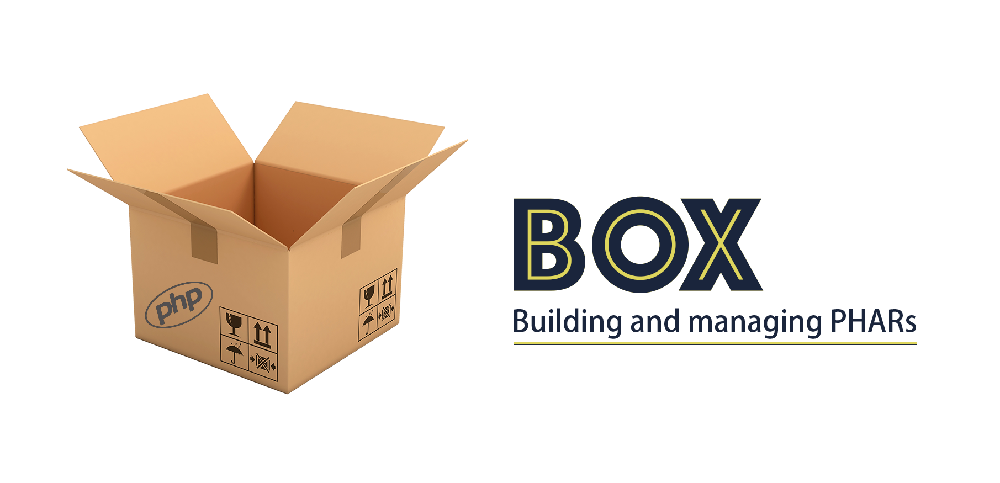

<p align="center">
    
</p>


[](https://packagist.org/packages/humbug/box)
[](https://travis-ci.org/humbug/box?branch=master)
[](https://scrutinizer-ci.com/g/humbug/box/?branch=master)
[](https://symfony.com/slack-invite)
[](LICENSE)

Fork of the unmaintained [box2 project](https://github.com/box-project/box2). This project needs your help!

Roadmap:
  - [Project board](https://github.com/humbug/box/projects/1)
  - [Medium article](https://medium.com/@tfidry/phars-roadmap-870671a847c1)


## Goal

The Box application simplifies the PHAR building process. Out of the box (no pun intended), the application can do many
great things:

- ⚡  Fast application bundling
- 🔨 PHAR isolation
- ⚙️ Zero configuration by default
- 🚔 Requirements checker
- 🚨 Friendly error logging experience 
- 🔍 Retrieve information about the PHAR extension or a PHAR file and its contents
- 🕵️‍♀️ Verify the signature of an existing PHAR
- 📝 Use Git tags and short commit hashes for versioning.


## Table of Contents

1. [Installation](#installation)
    1. [PHAR (preferred but NOT SUPPORTED YET)](#phar-preferred-but-not-supported-yet)
    1. [Composer](#composer)
1. [Creating a PHAR](#creating-a-phar)
1. [Configuration](doc/configuration.md)
    1. [Base path](doc/configuration.md#base-path-base-path)
    1. [Main](doc/configuration.md#main-main)
    1. [Output](doc/configuration.md#output-output)
    1. [Permissions](doc/configuration.md#permissions-chmod)
    1. [Check requirements][check-requirements]
    1. [Including files][include-files]
        1. [Files (`files` and `files-bin`)](doc/configuration.md#files-files-and-files-bin)
        1. [Directories (`directories` and `directories-bin`)](doc/configuration.md#directories-directories-and-directories-bin)
        1. [Finder (`finder` and `finder-bin`)](doc/configuration.md#finder-finder-and-finder-bin)
        1. [Blacklist (`blacklist`)](doc/configuration.md#blacklist-blacklist)
    1. [Stub](doc/configuration.md#stub)
        1. [Stub (`stub`)](doc/configuration.md#stub-stub)
        1. [Alias (`alias`)](doc/configuration.md#alias-alias)
        1. [Shebang (`shebang`)](doc/configuration.md#shebang-shebang)
        1. [Banner (`banner`)](doc/configuration.md#banner-banner)
        1. [Banner file (`banner-file`)](doc/configuration.md#banner-file-banner-file)
    1. [Dumping the Composer autoloader (`dump-autoload`)](doc/configuration.md#dumping-the-composer-autoloader-dump-autoload)
    1. [Compactors (`compactors`)][compactors]
    1. [Compression algorithm (`compression`)][compression-algorithm]
    1. [Signing algorithm (`algorithm`)](doc/configuration.md#signing-algorithm-algorithm)
1. [Requirements checker](#requirements-checker)
    1. [Usage](#usage)
    1. [Polyfills](#polyfills)
1. [Optimize your PHAR](#optimize-your-phar)
    1. [Review your files](#review-your-files)
    1. [Compress your PHAR](#compress-your-phar)
    1. [Optimize your code](#optimize-your-code)
1. [PHAR code isolation](#phar-code-isolation)
    1. [Why/Explanation](#whyexplanation)
    1. [Isolating the PHAR](#isolating-the-phar)
    1. [Debugging the scoping](#debugging-the-scoping)
1. [Contributing](#contributing)
1. [Upgrade](#upgrade)
1. [Backward Compatibility Promise (BCP)](#backward-compatibility-promise-bcp)
1. [Credits](#credits)


## Installation

### PHAR (preferred but NOT SUPPORTED YET)

<details>
  <summary>Coming soon.</summary>

  The preferred method of installation is to use the Box PHAR, which can be downloaded from the most recent
  [Github Release][releases]. Subsequent updates can be downloaded by running:
  
  ```bash
  box self-update
  ```
  
  As the PHAR is signed, you should also download the matching `box.phar.pubkey` to the same location. If you
  rename `box.phar` to `box`, you should also rename `box.phar.pubkey` to `box.pubkey`.
</details>


### Composer

You can install Box with [Composer][composer]:

```bash
composer global require humbug/box:^3.0@alpha
```

If you cannot install it because of a dependency conflict or you prefer to install it for your project, we recommend
you to take a look at [bamarni/composer-bin-plugin][bamarni/composer-bin-plugin]. Example:

```bash
composer require --dev bamarni/composer-bin-plugin
composer bin box require --dev humbug/box:^3.0@alpha
```

Keep in mind however that this library is not designed to be extended.


## Creating a PHAR

Creating a PHAR should be as simple as running `box compile` (no config required!). It will however assume some defaults
that you might want to change. Box will by default be looking in order for the files `box.json` and `box.json.dist` in
the current working directory. A basic configuration could be for example changing the PHAR permissions:

```json
{
    "chmod": "0755"
}
```

You can then find more advanced configuration settings in [the configuration documentation](doc/configuration.md).
For more information on which command or options is available, you can run:

```
box help
```


## Requirements checker

### Usage

Unlike when installing a library with [Composer][composer], no constraint check is done by default with a PHAR. As a result
if you are using a PHAR of an application compatible with PHP 7.2 in PHP 7.0 or a PHP environment which does not have a 
required extension, it will simply break with a non-friendly error.

By default, when building your PHAR with Box, Box will look up for the PHP versions and extensions required to execute your
application according to your `composer.json` and `composer.lock` files and ship a micro
[requirements checker][check-requirements] which will be executed when starting your PHAR.

The following are screenshots of the output when an error occurs (left) in a non-quiet verbosity and when all requirements
are passing on the right in debug verbosity.

<p align="center">
    
</p>


### Polyfills

Box supports the following polyfills:

- `symfony/polyfill-<extension-name>` for any extension
- [paragonie/sodium_compat](https://github.com/paragonie/sodium_compat) for the `libsodium` extension
- [phpseclib/mcrypt_compat](https://github.com/phpseclib/mcrypt_compat) for the `mcrypt` extension

Functions requirements/polyfills are not supported at the moment, see [#131](https://github.com/humbug/box/issues/131).


## Optimize your PHAR

### Review your files

By default Box try to be smart about which files are required and will attempt to use only the necessary files. You can
list the files of your PHAR with the box `info --list` command. It is however possible you want a finer control in which
case you can adapt the included files thanks to the [configuration options][include-files].

All the files in the PHAR are loaded in-memory when executing a PHAR. As a result, the more content there is to load,
the bigger the overhead will be and unlike your regular application, a PHAR will not benefit from the opcache optimisations.
The difference should however be minimal unless you have dozens of thousands of files in which case you might either
accept it, consider an alternative or contribute to the PHAR extension in order to optimise it.


### Compress your PHAR

You can also greatly enhance the size of your PHAR by compressing it:

- The [compression algorithm setting][compression-algorithm]. It is very efficient, however note that a compressed PHAR
  requires the `zip` PHP extension and has a (micro) overhead since PHP needs to uncompress the archive before using it
- [Compactors][compactors] can also help to compress some contents for example by removing the unnecessary comments and
  spaces in PHP and JSON files.


### Optimize your code

Another code performance optimisation that can be done is always use fully qualified symbols or use statements. For
example the following:

```php
<?php

namespace Acme;

use class stdClass;
use const BAR;
use function foo;

new stdClass();
foo(BAR);
```

Will be more performant than:

```php
<?php

namespace Acme;

use class stdClass;

new stdClass();
foo(BAR);
```

Indeed in the second case, PHP is unable to know from where `foo` or `BAR` comes from. So it will first try to find
`\Acme\foo` and `\Acme\BAR` and if not found will fallback to `\foo` and `BAR`. This fallback lookup creates a
minor overhead. Besides some functions such as `count` are optimised by opcache so using a fully qualified call
`\count` or importing it via a use statement `use function count` will be even more optimised.

However you may not want to care and change your code for such micro optimisations. But if you do, know that
[isolating your PHAR code](#phar-code-isolation) will transform every call into a fully qualified call whenever
possible enabling that optimisation for your PHAR.


## PHAR code isolation

### Why/Explanation

When bundling the code in a PHAR, it is equivalent to compacting all the code in a single file. However the code does
not go through any transformations, meaning the code in the PHAR remains unchanged. This, when the PHAR _loads_
external code, can lead to dependency conflicts. To illustrate that issue with an example: you are building a console
application `myapp.phar` which relies on the library Symfony YAML 2.8.0 which execute a given PHP script.

```bash
# Usage of the application we are building
myapp.phar myscript.php
```

For the sake of the example, `myapp.phar` is using Composer and loads the YAML component right away when starting, i.e.
when running `myapp.phar`, the class `Symfony\Yaml\Yaml` _from the PHAR_ is going to be loaded. Now what `myapp.phar`
is actually going to do is scan the whole file given, and do some reflection work on each classes found. I.e. for each
class `$class` found, it will do `new \ReflectionClass($class)`. 

Now if `myscript.php` is using the Symfony YAML 4.0.0 component with some new features added in 4.0.0 that are
non-existent in 2.8.0, when doing `new \ReflectionClass('Symfony\Yaml\Yaml')`, the class `Symfony\Yaml\Yaml` will be
loaded (yes, doing reflection on a class loads it!). BUT, it turns out the class `Symfony\Yaml\Yaml` is _already_
loaded: not the 4.0.0 from `myscript.php` but the one from the PHAR (`2.8.0`). **So any information you will get will
be from the wrong class!**

Is this really an issue? The answer is it depends. Here as a few real life example where this is an issue:

- A static analysis tool like [PHPStan][phpstan]
- A test framework like [PHPUnit][phpunit]
- A quality analysis tool like [SensioLabsInsight][sensiolabs-insight] which executes arbitrary code (e.g. to check)
  that the application is booting
- A piece of code that can be mixed with any code, such as a Wordpress plugin


### Isolating the PHAR

Box provides an integration with [PHP-Scoper][php-scoper]. To use it, [enable the `KevinGH\Box\Compactor\PhpScoper`
compactor](doc/configuration.md#compactors-compactors).

If you need an extra configuration for PHP-Scoper, you can create a `scoper.inc.php` file as
[per the documentation](https://github.com/humbug/php-scoper#configuration). The only difference is that you can
ignore the `finders` setting as the files to scope are already collected by Box.

And that's it!

Warning: keep in mind however that scoping is a very brittle process due to the nature of PHP. As such you will likely need
some adjustments in your code or the configuration.


### Debugging the scoping

As mentioned above, unless you have a very boring and predictable code (which is a good thing), due to how dynamic
PHP is, scoping will almost guaranteed never work on the first and will require adjustments. To help with the process,
there is two recommendations:

- Have an end-to-end test for your application. On in which you can easily swap from your regular binary, the PHAR and
  the isolated PHAR. This will help to identify at which test there is an issue besides being able to easily guarantee
  your application, shipped as a PHAR or not, is somewhat working.
- Make use of Box `--debug` option in the `compile` command. It dumps the code added to the PHAR in a `.box-dump`
  directory. This allows you to more easily inspect, alter and test the code shipped in the PHAR. This way, you can
  make sure the code shipped is working before worrying aboutwhetherr that code is going to work inside a PHAR.


## Contributing

The project provides a `Makefile` in which the most common commands have been registered such as fixing the coding
style or running the test.

```bash
make
```

## Upgrade

Check the [upgrade guide](UPGRADE.md).


## Backward Compatibility Promise (BCP)

The policy is for the major part following the same as [Symfony's one][symfony-bc-policy]. Note that the code marked
as `@private` or `@internal` are excluded from the BCP. 


## Credits

Project originally created by: [Kevin Herrera] ([@kherge]) which has now been moved under the [Humbug umbrella][humbug].


[releases]: https://github.com/humbug/box/releases
[bamarni/composer-bin-plugin]: https://github.com/bamarni/composer-bin-plugin
[Kevin Herrera]: https://github.com/kherge
[@kherge]: https://github.com/kherge
[humbug]: https://github.com/humbug
[phpstan]: https://github.com/phpstan/phpstan
[phpunit]: https://github.com/sebastianbergmann/phpunit
[sensiolabs-insight]: https://insight.sensiolabs.com/
[php-scoper]: https://github.com/humbug/php-scoper
[composer]: https://getcomposer.org/
[check-requirements]: doc/configuration.md#check-requirements-check-requirements
[include-files]: doc/configuration.md#including-files
[compression-algorithm]: doc/configuration.md#compression-algorithm-compression
[compactors]: doc/configuration.md#compactors-compactors
