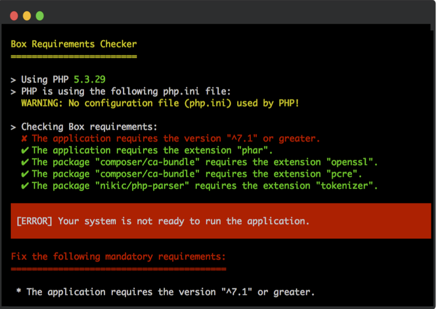
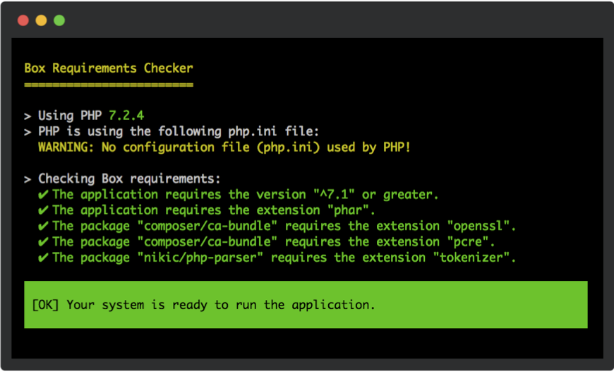

# Requirements checker

1. [Configuration](#configuration)
    1. [PHP version requirements](#php-version-requirements)
    1. [Extension configuration requirements](#extension-configuration-requirements)
    1. [Polyfills](#polyfills)
1. [Integration with a custom stub](#integration-with-a-custom-stub)


Unlike when installing a library with [Composer][composer], no constraint check is done by default with a PHAR. As a
result, if you are using a PHAR of an application compatible with PHP 8.2 in PHP 7.4 or a PHP environment which does not
have a required extension, it will simply break with a non-friendly error.

By default, when building your PHAR, Box will look up for the PHP versions and extensions required to execute your
application according to your `composer.json` and `composer.lock` files and ship a micro (~280KB uncompressed and >40KB
compressed) requirements checker which will be executed when starting your PHAR.

The following are screenshots of the output when an error occurs (left) in a non-quiet verbosity and when all
requirements are passing on the right in debug verbosity.




!!! Warning
     this check is still done within the PHAR. As a result, if [the required extension to open the PHAR][compression]
     due to the compression algorithm is not loaded, a hard failure will still appear:
     the requirement checker _cannot_ be executed before that.


## Configuration

Box will retrieve all the (non-dev) requirements including the ones of the dependencies if there is any. When a
`composer.lock` file is present, it will take the information from it. If not found, it will fallback on the
`composer.json` but that it will not be able to retrieve any information regarding the dependencies requirements in this
case.

This behaviour can be forcefully enabled or disabled via the [check requirements] setting.


### PHP version requirements

To register a minimal PHP version required by your application, you can register it as a requirement:

```json
{
    "require": {
        "php": "^7.2"    
    }
}
```

Note that [configuring the application to run in a specific version][composer-platform-php] will not affect it. So in
the following example:

```json
{
    "require": {
        "php": "^7.1"    
    },
    "config": {
        "platform": {
            "php": "7.1.10"
        }
    }
}
```

Composer will emulate PHP 7.1.10 environment. This makes sure that when installing the dependencies, they will be
compatible with 7.1.10+. It will however not affect the application requirements and as a result Box will pick `^7.1` as
the PHP requirement.


### Extension configuration requirements

To register an extension, you can specify it like so:

```json
{
    "require": {
        "ext-mbstring": "*"    
    }
}
```

Note that although you can specify a specific version for the extension requirements, Box does not currently support it
and will simply understand that the given extension is required regardless of the version specified.


### Polyfills

Box supports the following polyfills:

- `symfony/polyfill-<extension-name>` for any extension
- [paragonie/sodium_compat][paragonie sodium_compat] for the `libsodium` extension
- [phpseclib/mcrypt_compat][phpseclib mcrypt_compat] for the `mcrypt` extension

For example, if you have the following configuration:

```json
{
    "require": {
        "ext-mbstring": "*",
        "symfony/polyfill-mbstring": "^1.0" 
    }
}
```

Then the `mbstring` extension will not be required since its polyfill has been found.


## Integration with a custom stub

If you are using your own stub instead of the Box autogenerated one, you can still require the requirement checker
manually. When building the PHAR, Box will add the requirement checker in the `.box` directory. As a result, you can
require the requirement checker script `.box/check_requirements.php` like so:

```php
// Stub file
// Example where the PHAR used has the alias `acme.phar`

require 'phar://acme.phar/.box/check_requirements.php';
```

The requirement checker works down to PHP 7.2.5+. If however you are including it after your custom code which is not
PHP 7.2.5+ compatible, it will fail before the requirements are being checked.


## Skipping the requirement checker

When the requirement checker is shipped, you can always skip it by setting the environment variable
`BOX_REQUIREMENT_CHECKER` to `0`. For example if you are using the `box.phar` which ships a requirement checker and want
to skip it, you can run:

```shell
BOX_REQUIREMENT_CHECKER=0 php acme.phar 
```


## Logging to stdout

Since version 3.17.0, box logs the requirements checker output to `stderr` per default (see: [#678](https://github.com/box-project/box/issues/678)).
The requirements checker can be configured to output to `stdout` instead by setting `BOX_REQUIREMENTS_CHECKER_LOG_TO_STDOUT=1`:

```shell
BOX_REQUIREMENTS_CHECKER_LOG_TO_STDOUT=1 php acme.phar
```


<br />
<hr />

« [Configuration](configuration.md#configuration) • [Optimize your PHAR](optimizations.md#optimize-your-phar) »


[check requirements]: configuration.md#check-requirements-check-requirements
[composer]: https://getcomposer.org/
[compression]: configuration.md#compression-algorithm-compression
[composer-platform-php]: https://getcomposer.org/doc/06-config.md#platform
[paragonie sodium_compat]: https://github.com/paragonie/sodium_compat
[phpseclib mcrypt_compat]: https://github.com/phpseclib/mcrypt_compat
